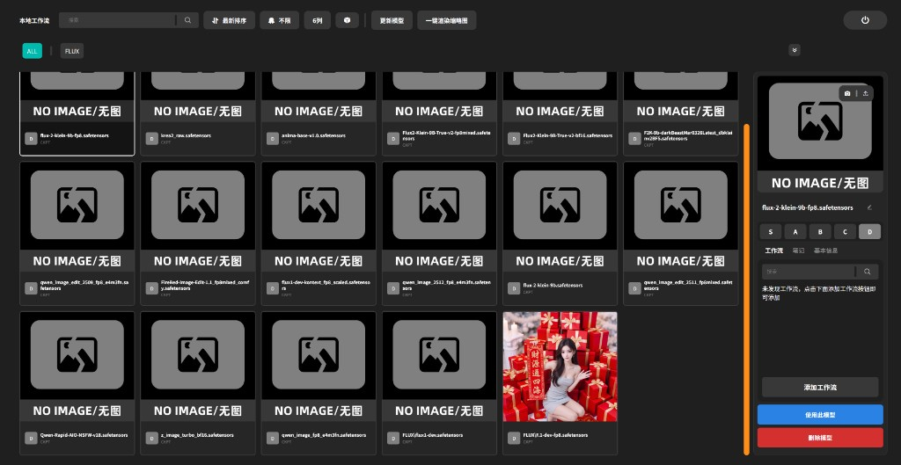

# SHADOW-ComfyUI-Studio

SHADOW-ComfyUI-Studio 是一款 ComfyUI 自定义节点插件，为模型加载器提供可视化的**模型管理器**，让模型浏览、筛选、评级与工作流关联更直观高效。



## 功能介绍

| 功能 | 说明 |
| :---- | :---- |
| 模型管理器 | 网格/列表浏览模型，支持搜索、排序、标签筛选、评级（S/A/B/C/D） |
| 模型缩略图 | 一键渲染缩略图，或使用本地图片作为模型封面 |
| 模型屏蔽 | 在指定加载器中隐藏不需要的模型 |
| 自动标签 | 根据模型所在文件夹路径自动生成标签，如 `checkpoints/SD1.5/real/A.ckpt` 会标记 `SD1.5`、`real` |
| 工作流关联 | 为模型绑定工作流，支持搜索、添加、加载、删除、复制到剪贴板 |
| 多语言 | 支持简体中文、繁体中文、英文 |

## 安装方法（仅 Windows 10/11）

SHADOW-ComfyUI-Studio 作为 ComfyUI 自定义节点使用，将插件文件夹放入 `custom_nodes` 目录即可。

```sh
cd ComfyUI/custom_nodes
git clone https://github.com/zy-akuo/SHADOW-ComfyUI-Studio.git
```

## 使用方法

1. 在 ComfyUI 中添加任意支持的加载器节点（如 Checkpoint、VAE、CLIP、LoRA 等）。
2. 点击节点底部的 **「SHADOW-ComfyUI-Studio 模型管理器」** 按钮，打开模型管理器界面。
3. 在管理器中选择模型后点击 **「使用此模型」**，即可回写到节点。
4. 点击模型字段（如 `clip_name`、`ckpt_name`）时，使用 ComfyUI **原生下拉列表**选择模型，便于同时调整 `type`、`device` 等其他参数。

## 支持的加载器

### 标准节点

自动支持 ComfyUI 官方节点及使用标准命名的自定义节点。标准字段名：

`ckpt_name`、`vae_name`、`clip_name`、`gligen_name`、`control_net_name`、`lora_name`、`style_model_name`、`hypernetwork_name`、`unet_name`

### 已适配的非标准节点

| Node name | 节点名称 |
| :---- | :---- |
| ImageOnlyCheckpointLoader | Checkpoint加载器(仅图像) |
| CheckpointLoaderSimple | Checkpoint加载器(简易) |
| unCLIPCheckpointLoader | unCLIPCheckpoint加载器 |
| CheckpointLoader | Checkpoint加载器 |
| VAELoader | VAE加载器 |
| CLIPVisionLoader | CLIP视觉加载器 |
| GLIGENLoader | GLIGEN加载器 |
| ControlNetLoader | ControlNet加载器 |
| DiffControlNetLoader | DiffControlNet加载器 |
| LoraLoaderModelOnly | LoRA加载器(仅模型) |
| LoraLoader | LoRA加载器 |
| StyleModelLoader | 风格模型加载器 |
| UpscaleModelLoader | 放大模型加载器 |
| HypernetworkLoader | 超网络加载器 |
| CLIPLoader | CLIP加载器 |
| DualCLIPLoader | 双CLIP加载器 |
| UNETLoader | UNET加载器 |
| DiffusersLoader | 扩散加载器 |

## 仓库

https://github.com/zy-akuo/SHADOW-ComfyUI-Studio
